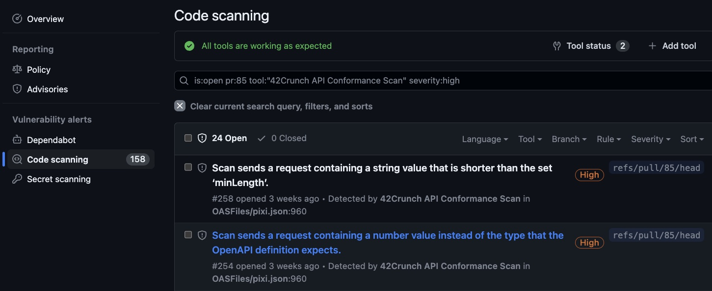
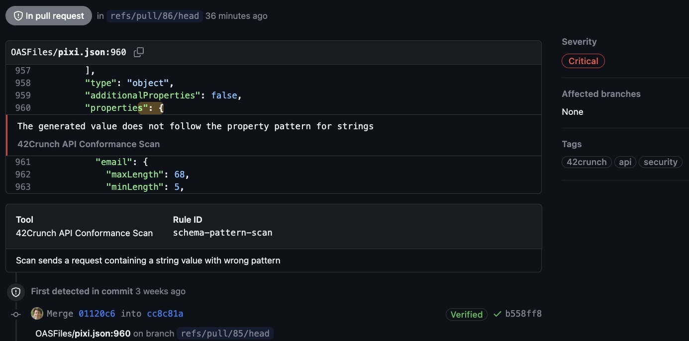

# GitHub Action: 42Crunch REST API Conformance and Security Testing

The REST API Dynamic Security Testing action can be used to enforce compliance to 42Crunch quality security gates, produce SARIF reports from raw 42Crunch reports and upload SARIF results to GitHub Code Scanning.

The action assumes that you have already run a scan, either via Docker or through [42Crunch Scand Manager.](https://github.com/42Crunch/scand-manager)

42Crunch  [API Conformance Scan](https://docs.42crunch.com/latest/content/concepts/api_contract_conformance_scan.htm) serves two purposes:

- Testing the resilience and behavior of APIs by automatically generating security tests from the APIs OpenAPI (aka Swagger) definition. Tests are injecting bad payloads, tokens and use invalid HTTP verbs and path to detect vulnerabilities, especially those associated to the [OWASP API Security Top 10](https://apisecurity.io/owasp-api-security-top-10/owasp-api-security-top-10-project/).
- Validating that the implementation of the API is indeed in line with its established contract.

## Security Quality Gates

Security quality gates are used to enforce security compliance across the enterprise by analyzing a conformance scan report and comparing it across the rules established centrally. Key examples include:

- Preventing APIs with API1 through API 5 vulnerabilities from being deployed
- Preventing APIs with high rish issues from being deployed 
- Preventing APIs with low test coverage from being deployed

## SARIF export

Additionally, you can export 42Crunch native JSON report format as a SARIF file. This file can then be used with third party tools or your own dashboards for analysis. 

## GitHub Code Scanning 

Finally, you can upload the SARIF results to GitHub Code Scanning, assuming Code Scanning is [enabled](https://docs.github.com/en/code-security/code-scanning/enabling-code-scanning) on your repository. Results will be shown on the `Security> Code Scanning` tab, where you can filter results by tool and by PR/Branch.



 A link is provided to directly pinpoint the location of the error in your source repository.



## Getting Started

To use this action, you must have an account on 42Crunch platform. You can request an account by contacting us from this page: https://42crunch.com/get-started/ .

Then, follow the steps described in the [documentation](https://docs.42crunch.com/latest/content/tasks/integrate_github_actions.htm) to create an API token for the action to authenticate to 42Crunch Platform, and save it as a secret in GitHub.

## Action Parameters

You can customize the action execution through various parameters:

| Parameter         | Required? | Description                                                  | Default                          |
| ----------------- | --------- | ------------------------------------------------------------ | -------------------------------- |
| api-token         | Yes       | API token to connect to 42Crunch platform                    |                                  |
| platform-url      | No        | Full URL of 42Crunch platform to connect to                  | `https://platform.42crunch.com)` |
| audit-report-path | Yes       | Report generated by the audit action execution, containing list of APIs and their platform UUIDs. |                                  |
| convert-to-sarif  | No        | Convert the scan reports to SARIF format                     | False                            |
| upload-sarif      | No        | Upload SARIF reports to Code Scanning                        | False                            |
| check-sqg         | No        | Check whether reports conforms to platform SQGs              | True                             |
| github-token      | No        | Access to GitHub Code Scanning                               | `${{ github.token }}`            |

### Sample Setup 

A typically which runs the scan and then analyzes the results would look like this:


```yaml
steps:
      - name: checkout repo
        uses: actions/checkout@v3
      - name: get_pixi_token
        id: get_pixi_token
        run: | 
          login_response=$(python .42c/scripts/pixi-login.py -u ${{ vars.PIXI_USER_NAME }} -p ${{ secrets.USER_PASS }} -t ${{ vars.PIXI_TARGET_URL }})
          echo "PIXI_TOKEN=$login_response" >> $GITHUB_OUTPUT
      - name: upload_v1_scan_config
        id: upload_v1_scan_config
        run: | 
          scanconfig_response=$(python .42c/scripts/scan_v1_config.py ${{github.server_url}}/${{ github.repository }} ${{ github.ref }} ${{ secrets.API_TOKEN }} '{$ACCESS_TOKEN}' ${{env.PLATFORM_URL}})
          echo "SCANV1_TOKEN=$scanconfig_response" >> $GITHUB_OUTPUT
      - name: download_audit_report    
        uses: actions/download-artifact@v3
        with:
          name: auditaction-report-${{ github.run_id }}
      - name: 42crunch-dynamic-api-testing
        uses: fjogeleit/http-request-action@v1
        with:
          url: ${{ vars.SCAND_MANAGER_URL }}
          method: POST
          contentType: "application/json"
          customHeaders: '{"Accept": "application/json"}'
          data: '{"token": "${{ steps.upload_v1_scan_config.outputs.SCANV1_TOKEN }}","name": "scand-${{ github.run_id }}-${{ github.run_attempt }}","platformService": "${{ env.PLATFORM_SERVICE_ENDPOINT }}","scandImage": "${{vars.SCAN_AGENT_V1}}","expirationTime": 600,"env": { "SECURITY_ACCESS_TOKEN": "${{ steps.get_pixi_token.outputs.PIXI_TOKEN }}"}}'
      - name: upload scan results
        uses: 42crunch/cicd-github-actions/scan@master
        with:
          api-token: ${{ secrets.API_TOKEN }}
          platform-url: ${{ env.PLATFORM_URL}}
          audit-report-path: audit-action-report-${{ github.run_id }}.json
          convert-to-sarif: scan-report-${{ github.run_id }}.sarif
          upload-sarif: true
          check-sqg: true
```

## Support

The action is maintained by the 42Crunch ecosystems team. If you run into an issue, or have a question not answered here, you can create a support ticket at [support.42crunch.com](https://support.42crunch.com/) and we will be happy to help.

When reporting an issue, do include:
- The version of the GitHub action
- Relevant logs and error messages
- Steps to reproduce the issue